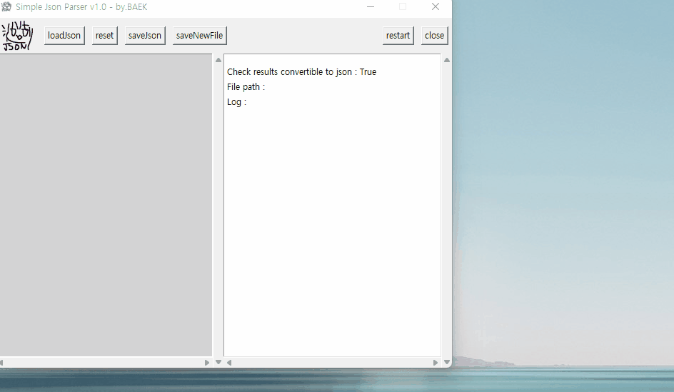
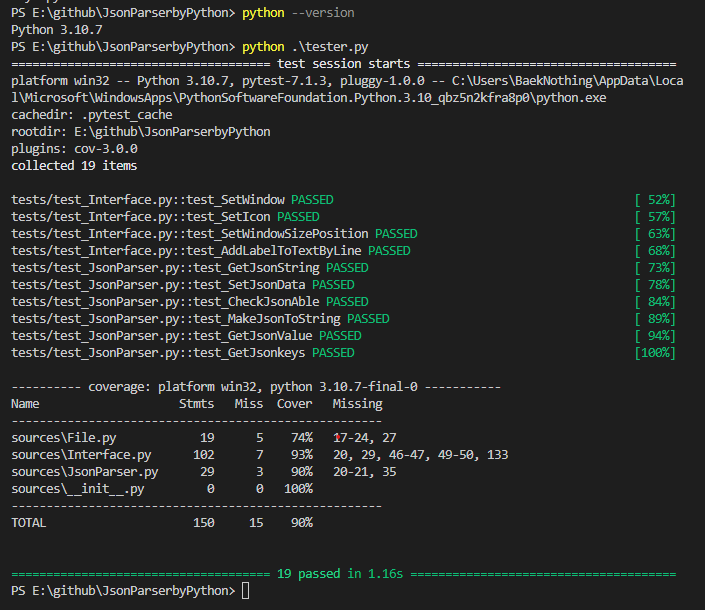

# Json Simple Editor

### by python




## About The Project

[]()

unity 등에서 데이터를 관리할 때 json형식을 주로 사용하고 있는데. {"key":"Value"} 형식을 따라 한줄로 쭉 이어져 있는 상태에서는 직관적으로 구조를 파악해 수정하기 어렵고, 실수로 key가 바뀌거나 json형식이 깨져버리는 상황도 종종 발생하는 등의 단점이 있었다.

이를 극복하기 위해, 추석 연휴에 짬을 좀 내가지고, 설치해서 바로 사용할 수 있는 에디터를 파이썬으로 간단히 구현해 보았다. __Unity와 같은 다른 프로젝트에서 사용되는 Json이 이미 있는 상황 & 유연함보다는 key와 형식을 준수하는게 더 중요한 상황__을 상정했기 때문에 "불러오기'', "value값 수정", "저장" 이 세가지 요소만 구현되어있다. 

## Built With

[](https://www.python.org/downloads/release/python-3107/)


## Getting Started

```bash
git clone https://github.com/BaekNothing/JsonEditorbyPython.git 
cd JsonEditorbyPython

pip install -r requirments.txt
python main.py
```

or

```bash
git clone https://github.com/BaekNothing/JsonEditorbyPython.git 
cd JsonEditorbyPython

./jsonEditor.exe
```


## Test Result



```bash
> python tester.py
```


## Contributing

이 프로젝트는 버그리포트, 제안, 이슈 등 모든 형태의 기여를 환영합니다. 🤣

The project welcomes all forms of contribution, including bug reports, suggestions, and issues.
